# ES-336-Assignment-2-Exploring-MIPS

### Chinmay Pendse (23110245)

## Introduction

For this assignment, I have used QSPIM Simulator to run all the codes given in this repository.

## Q1. Array Traversal

In this question, we are supposed to find some of the statistics of the array. To calculate the same, temporray registers were utilised for calculating the sum and iterators were also stored in the temperory registers. [q1.s] was run and the registers were shown somehig like this
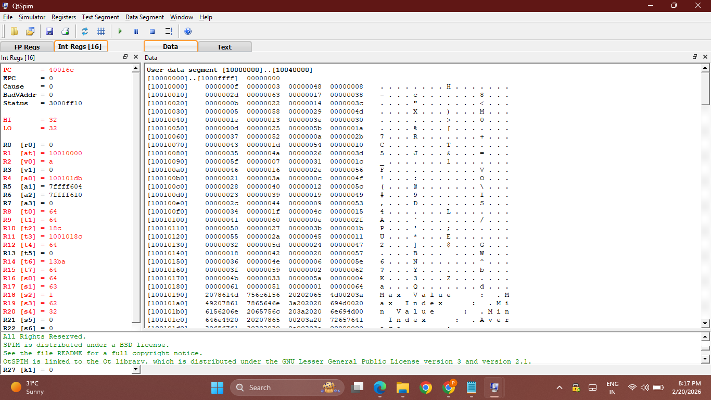
and the console output gave the correct analysis
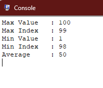

## Q2. Matrix Addition

In this question the matrices were added. We randomly choose matrices by using the chronical number order and added them as per [q2.s]. We had to reserve 64 bytes of space to store the output in matc. The registers came like this
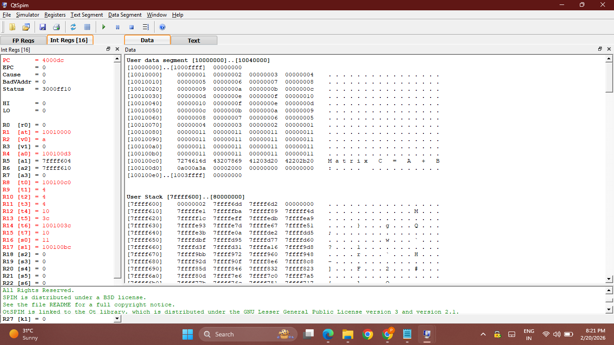

and the console output gave the correct addition as shown here
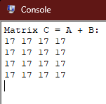

## Q3. Quick Sort

In this question we utilise the general quick sort algortihm in assembly language. [q3.s] was run and the registers were like
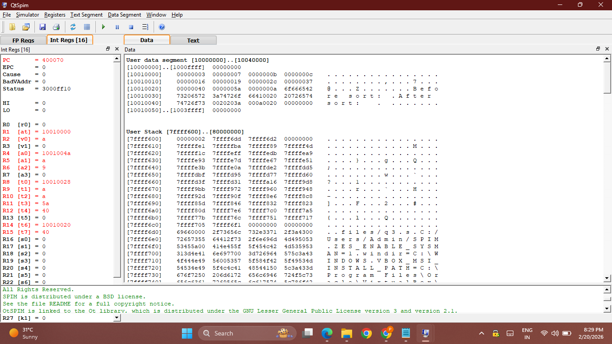

The console output is verified  as
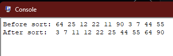

## Q4. Binary Search

We run [q4.s] in this question for an random array and search for one existant and one non existent entity in the array we get registers output as 
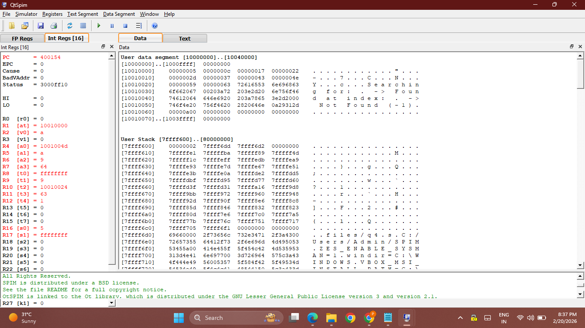

And the Console output verifies the same
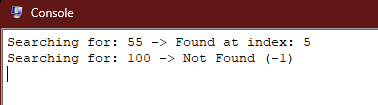

## Q5. Matrix Multiplication

[q5.s] was used for this question. In this assembly code we have to allocate a separate space of 100 bytes which the compiler does itself when we use that in Python or gcc. In Assignmnet 1 we could use the addresses directly but here we have to treat it like a single vetor and give base addresses  manuallyeach  time. Again we have to make all entities in matrix zero manually.
The register output
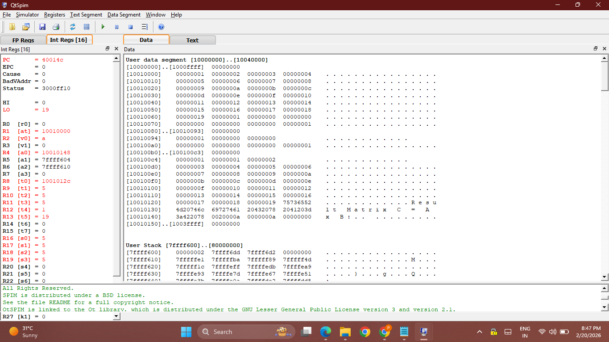

Console Output (Intentionally multiplication with identity matrix to verify the functionalty)
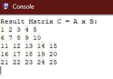

## Q6. Swapping string

We utilse the given functionality and present that in [q6.s]. We firstly store the string in the form of ascii in the gp and then we do the swap operation. The console output shows the string consverteed into int as we use syscall 1.

The registers output
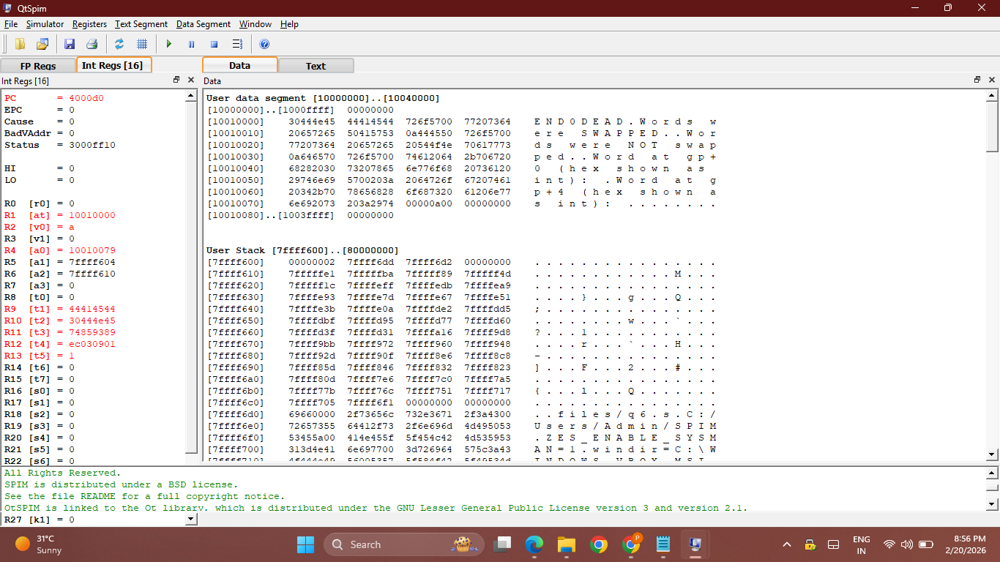

The console output
